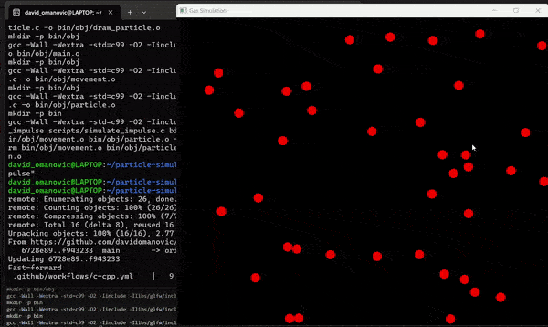

# Particle Simulator

This project implements Verlet integration to simulate particle physics in C, using GLFW for real-time visualization. You can directly run the `verlet_simulator` or other scripts (e.g., `simulate_impulse`, `simulate_potential`) inside `/bin`. The goal is to provide simple and visual simulations of particle physics. Currently implemented examples include gravity simulation, collision response, impulse dynamics, gas in a box, and particles in a potential field. Work on 3D simulations is in progress! 😄



---

## Table of Contents
- [Overview](#overview)
- [Features](#features)
- [Requirements](#requirements)
- [Installation](#installation)
- [Project Structure](#project-structure)
- [Usage](#usage)
- [Misc](#misc)


---

## Overview

Verlet integration is a numerical method used to simulate the motion of particles with great stability and minimal computational cost, even when forces become complex. This project leverages the Verlet algorithm to simulate realistic particle physics, including collision detection and response, in a 2D space. GLFW provides real-time rendering, enabling visual feedback and parameter adjustments like gravity, particle interaction, and potential fields.

---

## Features

- **Stable Verlet Integration**: Accurately simulates particle movement with position-based integration.
- **GLFW Visualization**: Real-time rendering of particles in a 2D environment.
- **Collision Handling**: Particle-to-particle and boundary collision detection with response.
- **Interactive Simulations**: Modify parameters or spawn particles dynamically using keyboard inputs.
- **Potential Field Dynamics**: Visualize and simulate particles in attractive or repulsive fields.
- **Performance Efficient**: Handles a large number of particles smoothly.

---

## Requirements

To build and run the project, ensure the following are installed:

- **C compiler** (e.g., GCC or Clang)
- **GLFW** library for OpenGL rendering
- **GLAD** for OpenGL function loading (included with GLFW)
- **Make** for building the project

### Ubuntu Installation:

```bash
sudo apt-get update
sudo apt-get install libglfw3-dev libglfw3 xorg-dev build-essential make
```

### Windows Installation:
Install MSYS2 and use its package manager:
```bash
pacman -S mingw-w64-x86_64-glfw mingw-w64-x86_64-gcc
```

### Project Structure
```makefile
Verlet-Particles/
├── bin/                # Compiled binaries
├── include/            # Header files
├── build/              # Build files
├── libs/               # Dependencies (e.g. GLFW, GLUT, Unity)
├── scripts/            # Example scripts (e.g., simulate_impulse.c, simulate_potential.c)
├── src/                # Core simulation logic
├── tests/              # Unit tests
├── assets/             # Assets for visualization (e.g., GIFs, images)
├── Makefile            # Build rules
└── README.md           # Documentation
```


### Installation
1. Clone this repository:
```bash
git clone https://github.com/davidomanovic/particle-simulator.git
cd particle-simulator
```
3. Clean the current build and build the project again:
```bash
make clean
make
```

### Usage
5. Run the binaries from /bin (executable files) after building, or use prebuilt project
```bash
./bin/simulate_impulse
./bin/gas_simulation
```

## Keyboard controls
- Spacebar: Spawn particles dynamically

## Contributions
Contributions are welcome! Fork this repository, make your changes, and submit a pull request.

## License
This project is licensed under the MIT License.
